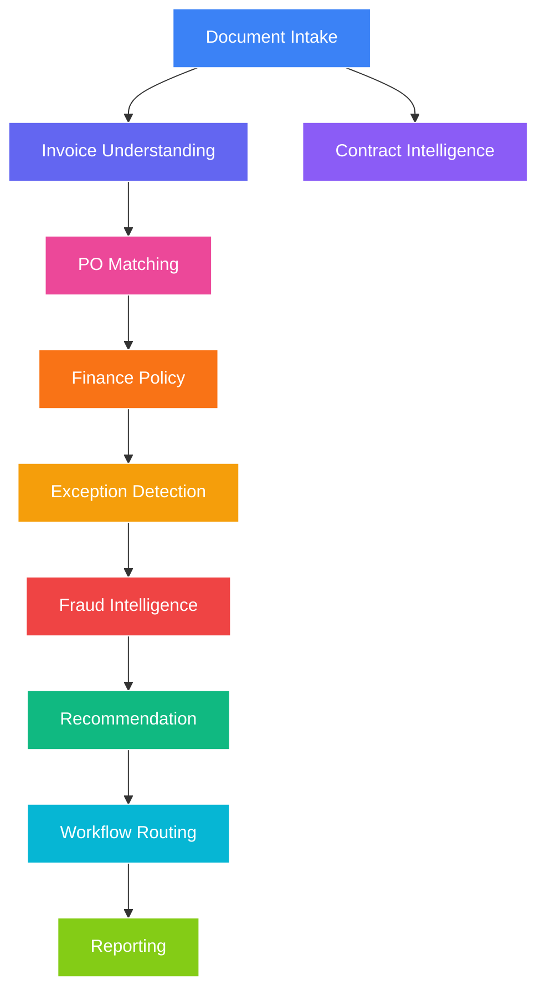

# Architecture Documentation

## System Architecture Diagram

```
┌────────────────────────────────────────────────────────────────────────┐
│                           PRESENTATION LAYER                              │
│                    Next.js 14 App Router + TypeScript                     │
│   Dashboard • Invoices • Upload • Vendors • Invoice Detail • Copilot       │
└─────────────────────────────────┄────────────────────────────────────────┘
                                    │
                                    ▼
┌────────────────────────────────────────────────────────────────────────┐
│                              API LAYER                                  │
│                        FastAPI + Async Endpoints                          │
│   /api/v1/invoices • /api/v1/auth • /api/v1/copilot • /api/v1/exceptions │
└─────────────────────────────────┄────────────────────────────────────────┘
                                    │
                                    ▼
┌────────────────────────────────────────────────────────────────────────┐
│                         APPLICATION LAYER                                 │
│                    Services & Pipeline Orchestration                       │
│  InvoiceProcessingService • DashboardService • CopilotService               │
└─────────────────────────────────┄────────────────────────────────────────┘
                                    │
                                    ▼
┌────────────────────────────────────────────────────────────────────────┐
│                          DOMAIN LAYER                                    │
│                    Entities & Agent Definitions                           │
│  Invoice • Vendor • Contract • ApprovalWorkflow • InvoiceException         │
│                                                                           │
│  ┌────────────────────────────────────────────────────────────────────┐ │
│  │                    AI AGENT ORCHESTRATOR                             │ │
│  │                                                                       │ │
│  │  Document Intake → Invoice Understanding → Contract Intelligence       │ │
│  │         ↓                                                              │ │
│  │  PO Matching → Finance Policy → Exception Detection                     │ │
│  │         ↓                                                              │ │
│  │  Fraud Intelligence → Recommendation → Workflow Routing                │ │
│  └────────────────────────────────────────────────────────────────────┘ │
└─────────────────────────────────┄────────────────────────────────────────┘
                                    │
                                    ▼
┌────────────────────────────────────────────────────────────────────────┐
│                       INFRASTRUCTURE LAYER                                  │
│                                                                           │
│  ┌───────────────┬───────────────┬───────────────┬───────────────┐        │
│  │   PostgreSQL  │   Redis       │    MinIO      │   ChromaDB    │        │
│  │  (Database)   │  (Cache+Q)    │  (Storage)    │  (Vectors)    │        │
│  └───────────────┴───────────────┴───────────────┴───────────────┘        │
│                                                                           │
│  ┌───────────────┬───────────────┬───────────────┐                         │
│  │  Azure OCR    │  Google OCR   │  PaddleOCR    │                         │
│  │  (Primary)    │  (Fallback)   │  (Fallback)   │                         │
│  └───────────────┴───────────────┴───────────────┘                         │
└────────────────────────────────────────────────────────────────────────┘
```

## Agent Pipeline Flow



## Database Schema (ERD)

```
┌─────────────────────────────────────────────────────────────────────────────┐
│                                  USERS                                       │
├─────────────────────────────────────────────────────────────────────────────┤
│ id (PK) • email • full_name • role • department • is_active • oauth_*         │
└─────────────────────────────────────────────────────────────────────────────┘
                                    │
           ┌────────────────────────┼────────────────────────┐
           ▼                        ▼                        ▼
┌─────────────────┐    ┌─────────────────┐    ┌─────────────────┐
│    INVOICES     │    │    AUDIT_LOGS   │    │   APPROVALS     │
├─────────────────┤    ├─────────────────┤    ├─────────────────┤
│ id (PK)         │    │ id (PK)         │    │ id (PK)         │
│ vendor_id (FK)  │◄──►│ user_id (FK)    │    │ invoice_id (FK) │
│ invoice_number  │    │ action          │    │ approver_id (FK)│
│ status            │    │ resource_type   │    │ approver_role   │
│ total_amount    │    │ resource_id     │    │ department      │
│ risk_score      │    └─────────────────┘    │ status          │
│ fraud_score     │                         │ decided_at      │
└─────────────────┘                           └─────────────────┘
        │
        ▼
┌─────────────────┐    ┌─────────────────┐
│ INVOICE_EXCEPT  │    │ AGENT_INSIGHTS  │
├─────────────────┤    ├─────────────────┤
│ id (PK)         │    │ id (PK)         │
│ invoice_id (FK) │◄──►│ invoice_id (FK) │
│ category          │    │ agent_name      │
│ severity          │    │ reasoning       │
│ title             │    │ confidence      │
│ financial_impact│    └─────────────────┘
│ estimated_loss  │
└─────────────────┘

┌─────────────────┐
│    VENDORS      │
├─────────────────┤
│ id (PK)         │
│ vendor_code     │
│ name            │
│ trust_score     │
│ country         │
│ currency        │
└─────────────────┘

┌─────────────────┐
│   CONTRACTS     │
├─────────────────┤
│ id (PK)         │
│ vendor_id (FK)│
│ contract_number │
│ title           │
│ status            │
└─────────────────┘
```

## Exception Categories

| Category | Description | Policy Reference |
|----------|-------------|------------------|
| PRICE_MISMATCH | Unit price exceeds contract terms | PROC-001, Contract Clause 4.2 |
| DUPLICATE_INVOICE | Invoice already processed | FIN-009 |
| MISSING_PO | No purchase order reference | PROC-001 |
| WRONG_GST | Missing or invalid GST number | FIN-012 |
| WRONG_VENDOR | Vendor not in approved list | PROC-005 |
| CONTRACT_EXPIRED | Contract past end date | Legal Policy |
| QUANTITY_MISMATCH | Invoiced qty > PO qty | 3-Way Match Rule |
| CURRENCY_MISMATCH | Currency doesn't match PO | FIN-003 |
| FRAUD_INDICATOR | Suspicious patterns detected | Fraud Policy |
| TAX_MISMATCH | Tax calculation incorrect | Tax Policy |
| DELIVERY_MISMATCH | No goods receipt match | GRN Policy |
| LATE_INVOICE | Beyond payment terms | FIN-007 |
| UNAUTHORIZED_APPROVER | Approver lacks permission | RBAC Policy |
| SPLIT_INVOICE | Split invoice pattern | Fraud Policy |
| ROUND_OFF_FRAUD | Suspicious round amounts | Fraud Pattern |
| REPEATED_PATTERN | Recurring anomalies | ML Detection |

## Security Implementation

- **Authentication**: JWT tokens with 30-minute expiration
- **Authorization**: Role-Based Access Control (RBAC)
- **Rate Limiting**: 100 requests/minute per IP
- **Audit Logging**: All invoice actions logged immutably
- **Document Security**: Presigned URLs with 1-hour expiry
- **Password Hashing**: bcrypt with salt rounds

## Deployment Architecture

```
┌─────────────────────────────────────────────────────────────────┐
│                        Kubernetes Cluster                         │
├─────────────────────────────────────────────────────────────────┤
│                                                                   │
│  ┌──────────────┐  ┌──────────────┐  ┌──────────────┐            │
│  │   Backend    │  │  Frontend    │  │   Worker     │            │
│  │  (Replicas)  │  │  (Replicas)  │  │  (1-4 pods)  │            │
│  └──────────────┘  └──────────────┘  └──────────────┘            │
│        │                │                │                      │
│  ┌────▼────┐     ┌────▼────┐     ┌────▼────┐                 │
│  │   Redis  │     │   CDN   │     │   Redis  │                 │
│  │ (Session)│     │ (Static)│     │ (Broker) │                 │
│  └──────────┘     └──────────┘     └──────────┘                 │
│        │                                                        │
│  ┌────▼────┐     ┌──────────────┐                               │
│  │ PostgreSQL│     │    MinIO     │                               │
│  │ (Primary)│     │ (S3 Compat) │                               │
│  └──────────┘     └──────────────┘                               │
│                                                                   │
│                    ┌──────────────┐                               │
│                    │   ChromaDB   │                               │
│                    │ (Vectors)    │                               │
│                    └──────────────┘                               │
│                                                                   │
└─────────────────────────────────────────────────────────────────┘